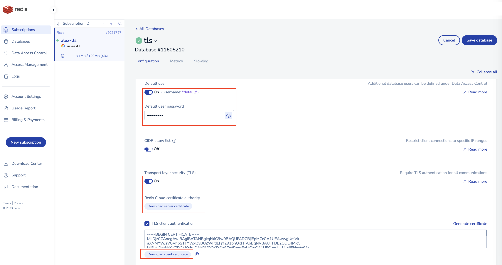
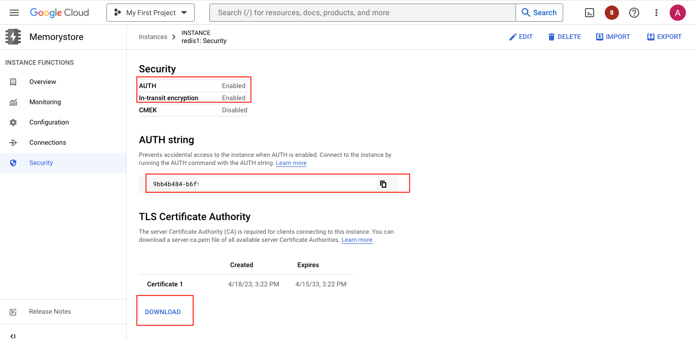

# Connect TLS & mTLS to Redis Enterprise and Redis Enteprise Cloud

### Redis Enterprise Cloud

- Create a database
- Activate TLS
- Download and unzip the Redis CA certificate

- Create a truststore (note: here using JKS format, see Java docs for other options)
```
keytool -import -noprompt -file redis_ca.pem -alias ca_cert -keystore ca.jks -storepass password
```

(optional)
- If using mTLS, enable client mTLS and generate/download client certificate and private key
```
openssl pkcs12 -export -in redis_user.crt -inkey redis_user_private.key -out client-keystore.p12 -passout pass:password
```



### Google Memorystore

- Create a database
- Activate Auth and TLS
- Download and unzip the Memorystore CA certificate

```
keytool -import -noprompt -file server-ca.pem -alias ca_cert -keystore ca.jks -storepass password
```




## Jedis

Build and run
```
./mvn package
java -jar target/skel-1.0-SNAPSHOT.jar

or with options:
java -jar target/skel-1.0-SNAPSHOT.jar -h host -p port -a auth

and for mTLS with a keystore
java -jar target/skel-1.0-SNAPSHOT.jar -h host -p port -a auth --mtls
```

## Bastion VM for testing

For Memorystore, you can only access it when you have VPC peering or private connect in place as there are no public endpoint.

```
sudo apt update
sudo apt install openjdk-17-jdk
java -version
// git clone and build
```

# Reference

[Redis Cloud TLS & mTLS](https://docs.redis.com/latest/rc/security/database-security/tls-ssl/#enable-tls)

[Redis developers - using TLS & mTLS](https://developer.redis.com/howtos/security/)

[Jedis test cases](https://github.com/redis/jedis/blob/master/src/test/java/redis/clients/jedis/SSLJedisTest.java)


